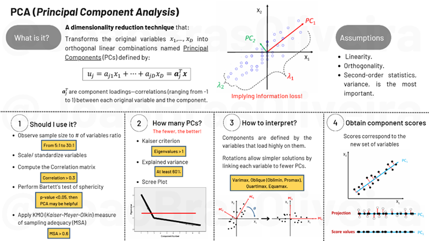
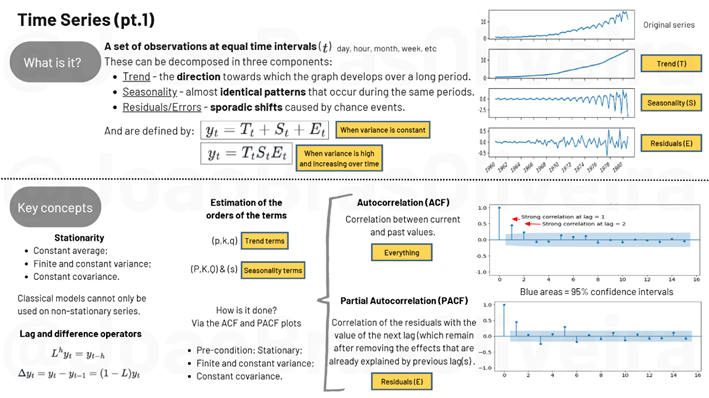
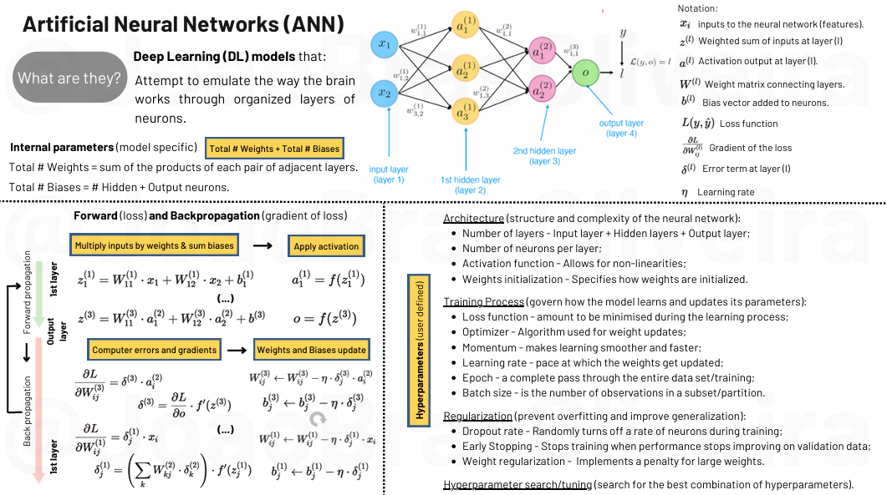
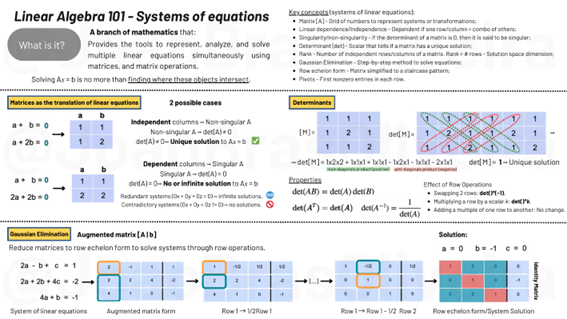
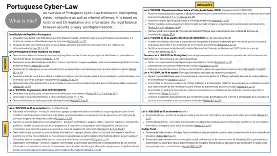
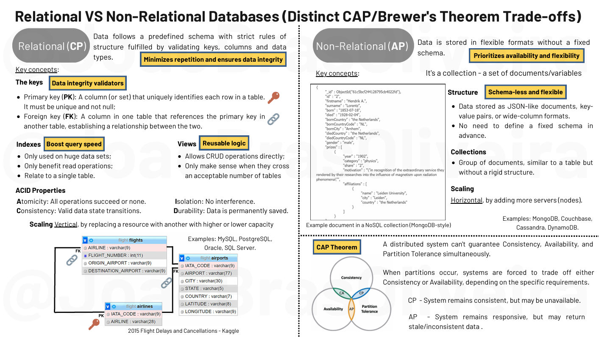

# Simple Machine Learning Explained
## Goal
This repository aims to share slides I made for my own and that may hopefully help others understand important notions/ processes of Machine Learning in the shortest way conceivable. It currently includes:

- **Principal Component Analysis (PCA)** - the dimensionality reduction technique;
- **Time-Series** - a set of observations at equal time intervals (t);
- **Artifical Neural Networks (ANN)** - Models that attempt to emulate the way the brain works through organized layers of neurons.
- **Linear Algebra (pt.1), Systems of equations** - Represent, analyze, and solve multiple linear equations simultaneously using matrices, and matrix operations.
- **Portuguese CyberLaw** - An overview of Portuguese Cyber-Law framework, highlighting rights,  obligations as well as criminal offenses.

To be added - "_Work in progress_":

- **Natural Language Processing (NLP)** - Techniques that enable computers to understand, interpret, and generate human language;
- **Databases** - Relational (SQL) VS Non-relational databases (NoSQL).
- **Linear Algebra, Transformations** - Represent, analyze, and transform geometric objects and spaces using matrices, revealing how vectors change direction and magnitude under linear mappings.
- **Calculus** - Derivatives, gradients, optimizers and Newton´s Method;
- **Statistics** - Probability, distributions, sampling.

## Content

### Resources

| [   Image Credit: Own creation](./PrincipalComponentAnalysis_JoaoBrasOliveira.pdf) | [   Image Credit: Own creation](./TimeSeriesAnalysis_pt1_JoaoBrasOliveira.pdf) | [   Image Credit: Own creation](./ArtificialNeuralNetworks_pt1_JoaoBrasOliveira.pdf) |
|:---:|:---:|:---:|
| **Principal Component Analysis** | **Time-Series Analysis** | **Artificial Neural Networks** |

| [   Image Credit: Own creation](./LinearAlgebra_pt1_SystemsofEquations_JoaoBrasOliveira.pdf) | [   Image Credit: Own creation](./PortugueseCyberLaw_JoaoBrasOliveira.pdf) | [   Image Credit: Own creation](./RelationalVSnonRelationalDB_JoaoBrasOliveira.pdf) |
|:---:|:---:|:---:|
| **Linear Algebra (pt.1), Systems of equations** | **Portuguese CyberLaw** | **Databases** |

| [   Image Credit: Created by <a href="https://unsplash.com/pt-br/@gaellemarcel" target="_blank">Gaelle Marcel</a>] | [   Image Credit: Created by <a href="https://unsplash.com/pt-br/@gaellemarcel" target="_blank">Gaelle Marcel</a>] |
|:---:|:---:|
| **Calculus** | **Statistics** |

